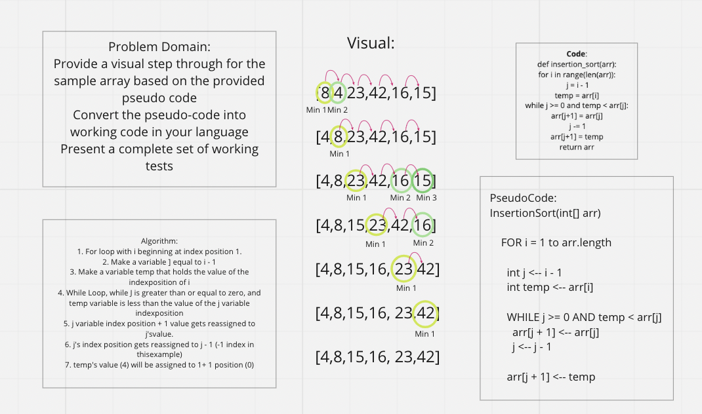

# Insertion sort

**Given Array**:

[8,4,23,42,16,15]

## Process



## Algorithm

1. For loop with i beginning at index position 1.
2. Make a variable ] equal to i - 1
3. Make a variable temp that holds the value of the index position of i
4. While Loop, while J is greater than or equal to zero, and temp variable is less than the value of the j variable index position
5. j variable index position + 1 value gets reassigned to j's value.
6. j's index position gets reassigned to j - 1 (-1 index in this example)
7. temp's value (4) will be assigned to 1+ 1 position (0)

## Code

```
def insertion_sort(arr):
    for i in range(len(arr)):
        j = i - 1
        temp = arr[i]

        while j >= 0 and temp < arr[j]:
            arr[j+1] = arr[j]
            j -= 1
        arr[j+1] = temp
    return arr
```