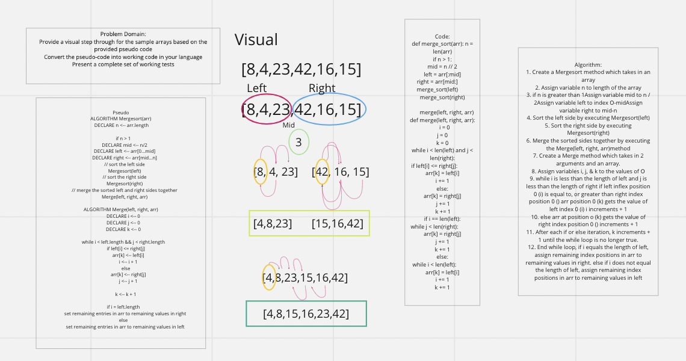

# Merge Sort

## Problem Domain

Provide a visual step through for the sample arrays based on the provided pseudo code
Convert the pseudo-code into working code in your language
Present a complete set of working tests

## Algorithm

1. Create a Mergesort method which takes in an array
2. Assign variable n to length of the array
3. if n is greater than 1Assign variable mid to n / 2Assign variable left to index O-midAssign variable right to mid-n
4. Sort the left side by executing Mergesort(left)
5. Sort the right side by executing Mergesort(right)
6. Merge the sorted sides together by executing the Merge(left, right, arr)method
7. Create a Merge method which takes in 2 arguments and an array.
8. Assign variables i, j, & k to the values of O
9. while i is less than the length of left and j is less than the length of right if left inflex position 0 (i) is equal to, or greater than right index position 0 () arr position 0 (k) gets the value of left index 0 (i) i increments + 1
10. else arr at position o (k) gets the value of right index position 0 () increments + 1
11. After each if or else iteration, k increments + 1 until the while loop is no longer true.
12. End while loop, if i equals the length of left, assign remaining index positions in arr to remaining values in right. else if i does not equal the length of left, assign remaining index positions in arr to remaining values in left
