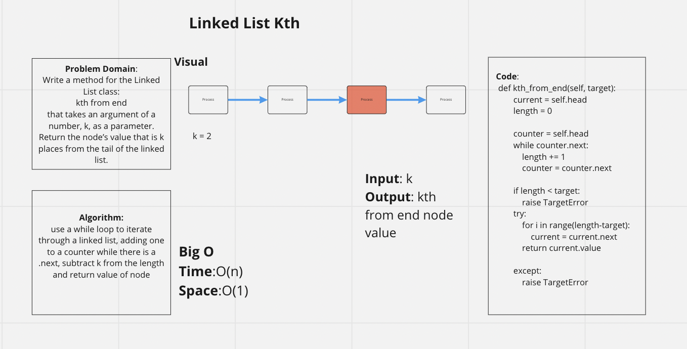

# Challenge Summary

Write a method for the Linked List class:
kth from end
that takes an argument of a number, k, as a parameter.
Return the node’s value that is k places from the tail of the linked list.

## Whiteboard Process

## Approach & Efficiency

Used a while loop to determine length of list, and a for loop to return value
Time: O(n)
Space:O(1)

## Solution

type pytest into terminal to run
