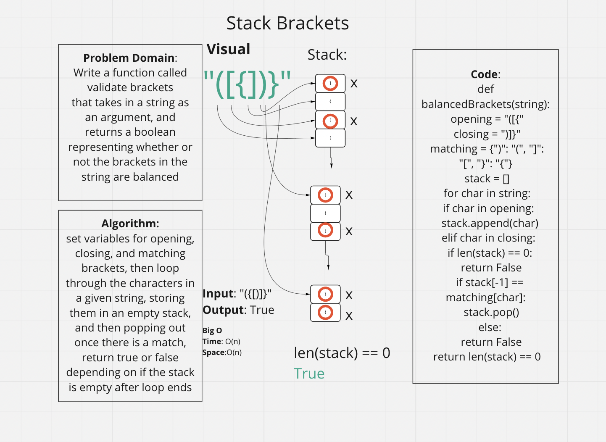

# Challenge Summary

Write a function called validate brackets
that takes in a string as an argument, and
returns a boolean
representing whether or not the brackets in the string are balanced

## Whiteboard Process

## Approach & Efficiency

Time: O(n)
Space:O(n)

## Solution

type pytest into terminal to run
