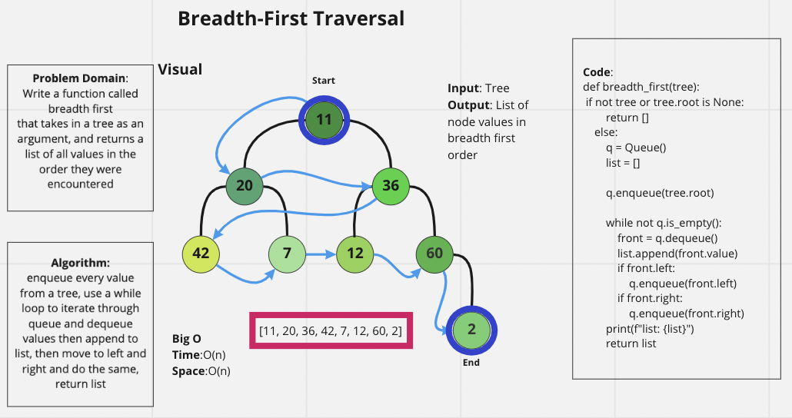

# Challenge Summary

Write a function called breadth first
Arguments: tree
Return: list of all values in the tree, in the order they were encountered

## Whiteboard Process

## Approach & Efficiency

Breadth first traversal approach as required by the challenge, O(n) for both time and space

## Solution

Type `pytest` into terminal