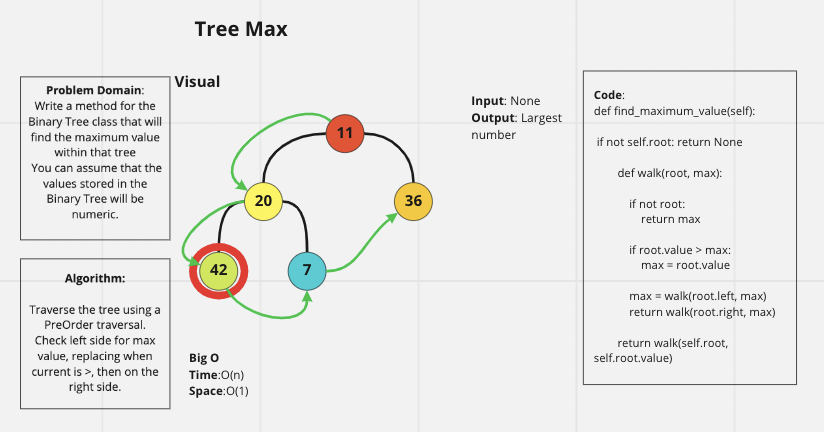

# Tree Max

Write a method for the Binary Tree class that will
find the maximum value within that tree
 You can assume that the values stored in the Binary Tree will be numeric.


## Whiteboard Process

 

## Approach & Efficiency

I took a PreOrder traversal approach, because its the one that is the most comfortable to work with.
Big O:
Time: O(n)
Space: O(1)

## Solution

Use ```pytest``` to test code
