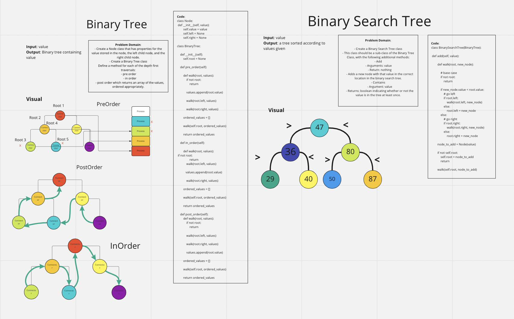

# Trees

## Challenge

- Create a Node class that has properties for the value stored in the node, the left child node, and the right child node.
- Create a Binary Tree class
Define a method for each of the depth first traversals:

### APIs:

    - pre order
    - in order
    - post order which returns an array of the values, ordered appropriately.

- Create a Binary Search Tree class
- This class should be a sub-class of the Binary Tree Class, with the following additional methods:

### APIs:

- Add
    - Arguments: value
    - Return: nothing
    - Adds a new node with that value in the correct location in the binary search tree.
- Contains
    - Argument: value
    - Returns: boolean indicating whether or not the value is in the tree at least once.

## Approach & Efficiency

